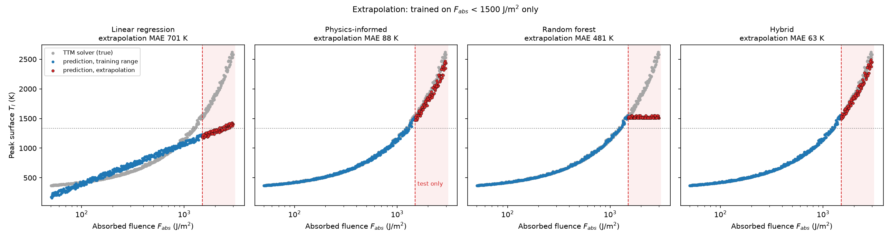
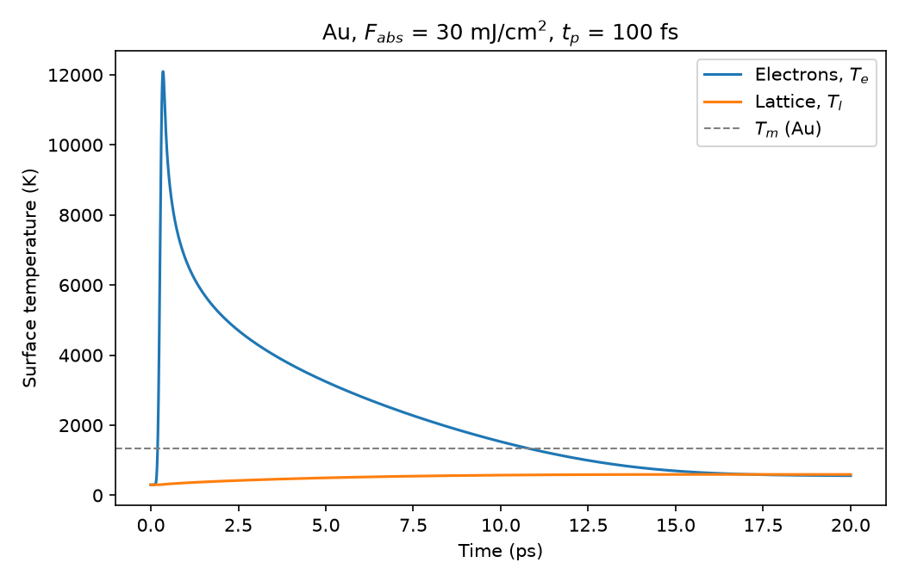
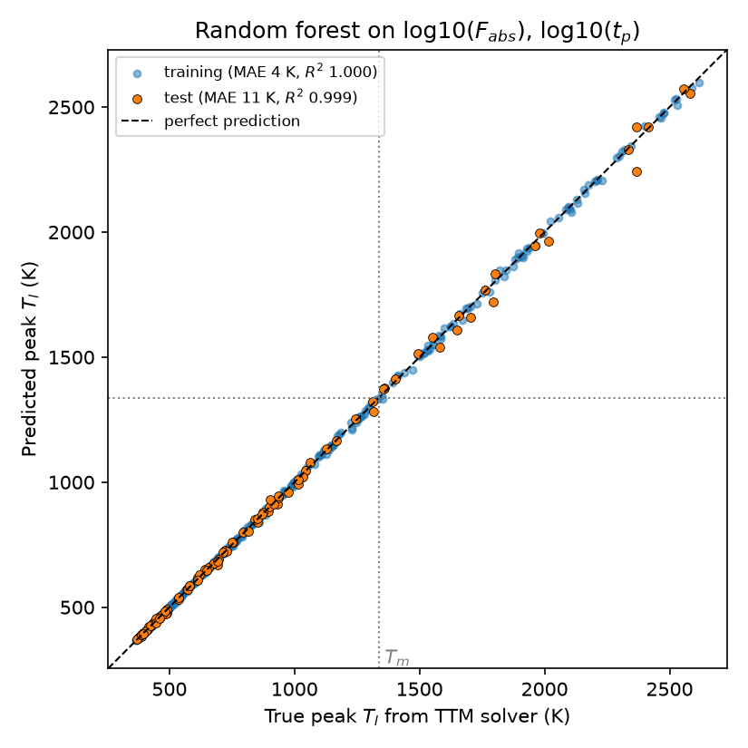

# TTM-ML Surrogate: machine-learning models for ultrafast laser heating of gold

A machine-learning surrogate for a one-dimensional two-temperature model (TTM) of
femtosecond-to-picosecond laser heating of gold. From 500 solver runs spanning absorbed
fluences of 50–3000 J/m² (5–300 mJ/cm²) and pulse durations of 50 fs–2 ps, a hybrid model
(a physics-motivated power law plus a random forest trained on its residuals) predicts the peak
surface lattice temperature of unseen runs with a mean absolute error of **1.6 K**, comparable
to the solver's own numerical uncertainty of about 1–3 K. In an extrapolation test towards
higher fluence (trained only below 1500 J/m², tested up to 3000 J/m²) its error is 63 K,
compared with 481 K for a plain random forest. Whether the surface reaches the melting temperature
is classified with 99–100 % test accuracy; in this model the threshold is about 125 mJ/cm²
absorbed fluence.


*Models trained on F_abs < 1500 J/m² only (blue) and tested above it (red, shaded). The random
forest cannot predict beyond its highest training value; the power law and the hybrid follow the
solver (grey).*

---

## Physics model

### Equations

Electrons and lattice are described by two coupled heat equations in depth $z$
(Anisimov et al., 1974):

$$C_e(T_e)\,\frac{\partial T_e}{\partial t} = \frac{\partial}{\partial z}\left(k_e\,\frac{\partial T_e}{\partial z}\right) - G\,(T_e - T_l) + S(z,t)$$

$$C_l\,\frac{\partial T_l}{\partial t} = G\,(T_e - T_l)$$

with free-electron heat capacity $C_e = \gamma T_e$, electron thermal conductivity
$k_e = k_0\,T_e/T_l$ and a Gaussian laser source absorbed over the optical penetration depth
$\delta$:

$$S(z,t) = F_{abs}\;\frac{e^{-z/\delta}}{\delta}\;\frac{2}{t_p}\sqrt{\frac{\ln 2}{\pi}}\;\exp\!\left(-4\ln 2\,\frac{(t-t_0)^2}{t_p^2}\right)$$

where $F_{abs}$ is the **absorbed** fluence, $t_p$ the pulse duration (FWHM) and $t_0 = 3t_p$.

### Gold parameters

| Quantity | Symbol | Value | Source |
|---|---|---|---|
| Electron heat capacity coefficient | $\gamma$ | 71 J m⁻³ K⁻² | within the range reported in [2, 3] |
| Electron–phonon coupling | $G$ | 2.2 × 10¹⁶ W m⁻³ K⁻¹ | within the range reported in [2, 3] |
| Lattice heat capacity | $C_l$ | 2.5 × 10⁶ J m⁻³ K⁻¹ | room-temperature handbook value |
| Electron thermal conductivity at 300 K | $k_0$ | 318 W m⁻¹ K⁻¹ | room-temperature handbook value |
| Optical penetration depth (800 nm) | $\delta$ | 15 nm | typical value for gold at 800 nm |
| Melting temperature | $T_m$ | 1337 K | handbook value |

### Numerical method

- **Grid:** finite volumes, 1 nm cells, 1 µm thick sample, insulated front and back surfaces;
  initial temperature 300 K; simulated time 100 ps.
- **Electron diffusion:** implicit (backward Euler), solved as a tridiagonal system. The
  electron–lattice coupling is also implicit and eliminated analytically.
- **Heat capacity:** two Picard iterations with $C_e = \gamma (T_e^{old} + T_e^{new})/2$, so the
  electron energy change is exact.
- **Laser source:** the Gaussian pulse is integrated exactly over each time step (error
  function), and the depth profile is normalised on the grid, so exactly $F_{abs}$ is
  deposited regardless of step size.
- **Adaptive time step:** 2 fs until the pulse is over ($t_0 + 3t_p$), then growing by ×1.05
  per step up to 50 fs. A 100 ps run with a 100 fs pulse takes 2335 steps instead of 50 000
  with a constant 2 fs step (about 1 s), with peak temperatures unchanged to within 1 K.


*Surface temperatures for F_abs = 300 J/m² (30 mJ/cm²), t_p = 100 fs, first 20 ps.*

### Validation

| Check | Result |
|---|---|
| Energy conservation (all 500 data runs) | \|error\| ≤ 0.085 % |
| Time step: 1 fs / 10 fs max instead of 2 fs / 50 fs ([`checks/convergence_check.py`](checks/convergence_check.py)) | peak $T_l$ changes ≤ 0.97 K (0.04 %) |
| Grid: 0.5 nm instead of 1 nm cells (same script) | peak $T_l$ changes ≤ 0.01 K |
| Thickness: 1 µm vs 4 µm ([`checks/thickness_check.py`](checks/thickness_check.py)) | peak $T_l$ changes ≤ 3.3 K (0.13 %); melting unchanged |
| Simulated time long enough | every run reaches its peak $T_l$ by 50.3 ps (of 100 ps) |

The thickness check is needed at 100 ps but not at shorter times. The electron diffusivity
$D = k_e/C_e = k_0/(\gamma T_l) \approx 0.015$ m²/s gives a diffusion length $\sqrt{Dt} \approx 1.2$ µm
at 100 ps, so heat reaches the back surface. It does so only after the surface lattice
temperature has peaked (17–49 ps).

## Data generation

[`generate_data.py`](generate_data.py) samples 500 combinations of $\log_{10} F_{abs}$ and
$\log_{10} t_p$ with a **Latin hypercube** (McKay et al., 1979; seed 42) and runs the solver for
each, which takes about 11 minutes (the solver runs on a single CPU core).

- **Log space:** both inputs span more than a factor of 40, and the response depends on ratios,
  so each decade gets the same number of samples.
- **Latin hypercube:** each input range is divided into 500 equal strips, and every strip holds
  exactly one sample. This covers the space evenly without the gaps and clusters of plain
  random sampling.

The result is [`data/data.csv`](data/data.csv). It has one row per run: `F_abs` (J/m²), `tp`
(s), `Te_peak` and `Tl_peak` (peak surface temperatures, K), `melted` (1 if the lattice reached
$T_m$), `energy_error`, and `t_Tl_peak` (s).

**Melting threshold.** 105 of the 500 runs (21 %) reach $T_m$. The boundary is sharp and only
weakly dependent on pulse duration:
- **In the data:** the lowest fluence that melts is 1231 J/m² (at 1082 fs), and the highest that
  does not is 1278 J/m² (at 69 fs).
- **From logistic regression:** the threshold is about 1313 J/m² at 100 fs and 1161 J/m² at 2 ps,
  i.e. **about 115–130 mJ/cm² absorbed**.

## Models and results

All models use $\log_{10} F_{abs}$ and $\log_{10} t_p$ as inputs. The data are split once into
80 % training and 20 % test runs (stratified on `melted`, seed 42). All model settings are chosen
by 5-fold cross-validation on the training runs only. The test runs are used once, for the
numbers below.

**The four regression models for peak $T_l$:**
1. **Linear regression:** a plane in $(\log F, \log t_p)$.
2. **Physics-informed power law:** linear regression on $\log_{10}(T_l - 300\,\mathrm{K})$, i.e.
   $T_l - 300\,\mathrm{K} = A\,F^a\,t_p^b$, motivated by energy balance ($\Delta T \approx F/(C_l d)$
   with a heated depth $d$ set by electron diffusion). It can never predict below 300 K. The fit
   gives:

   $$T_l - 300\,\mathrm{K} = 888\,\mathrm{K}\;\left(\frac{F_{abs}}{1000\ \mathrm{J/m^2}}\right)^{0.850}\left(\frac{t_p}{1\ \mathrm{ps}}\right)^{0.026}$$

   The exponent below 1 reflects a heated depth that grows with fluence. Electrons hand their
   energy to the lattice on the coupling time $\tau = C_e/G = \gamma T_e/G$, which grows with
   $T_e$, while their diffusivity $D = k_0/(\gamma T_l)$ does not depend on $T_e$. Hotter
   electrons therefore diffuse further, about $\sqrt{D\tau}$, before heating the lattice. The
   energy is spread over a larger depth, and the surface temperature rises less than in
   proportion to $F_{abs}$.
3. **Random forest:** 300 trees; depth and leaf size chosen by cross-validation.
4. **Hybrid (residual learning):** the power law, plus a random forest trained on the power
   law's residuals $T_l - T_l^{\,\mathrm{power\ law}}$. Both stages are refitted inside every
   cross-validation fold.

| Model for peak $T_l$ | Test MAE | Test R² | Extrapolation MAE ¹ |
|---|---|---|---|
| Linear regression | 202 K | 0.8148 | 701 K |
| Physics-informed power law | 12.6 K | 0.9982 | 88 K |
| Random forest | 11.5 K | 0.9987 | 481 K |
| **Hybrid (power law + random forest on residuals)** | **1.6 K** | **1.0000** | **63 K** |

¹ Trained on the 415 runs with F_abs < 1500 J/m², tested on the 85 runs with F_abs ≥ 1500 J/m²
(true peak $T_l$ 1503–2618 K).

| Classifier for melting | Test accuracy | Recall (melted) | False alarms | CV balanced accuracy |
|---|---|---|---|---|
| Logistic regression, default C = 1 | 98 % | 90.5 % (19/21) | 0 | 98.8 % |
| Logistic regression, C = 1000 (chosen by CV) | 99 % | 95.2 % (20/21) | 0 | 99.4 % |
| Random forest | 100 % | 100 % (21/21) | 0 | 98.7 % |

The test set contains 100 runs, 21 of them melted. Accuracy alone is misleading here: always
predicting "not melted" would score 79 %. Recall for the melted class and balanced accuracy show
whether melting is actually detected. The three classifiers differ by only 1–2 test runs, so
the cross-validation scores are the more reliable ranking.


*Random forest: predicted against true peak lattice temperature for training (blue) and test
(orange) runs.*

## Key findings

- **The random forest is the best plain model inside the sampled range** (11.5 K), but it cannot
  extrapolate. Its predictions are averages of training values, so it flattens at the highest
  training temperature (1550 K) while the true value rises to 2618 K.
- **The physics-informed power law** is almost as accurate inside the range (12.6 K) with only
  three parameters. In the extrapolation test it is **the only plain model that follows the
  solver** (88 K error up to twice the highest training fluence).
- **In both tests, the hybrid is the most accurate model:** 1.6 K on the held-out test runs and
  63 K in the extrapolation test. Inside the range its forest only has to learn a small
  correction (residuals of −20 to +111 K instead of temperatures spanning 2250 K), so its error
  is 7× smaller than the forest alone. In the extrapolation test the correction stays at its
  value at the edge of the training range, which happens to offset part of the power law's
  underprediction. A single extrapolation test towards higher fluence does not show that this
  will hold in general.
- **The hybrid's error (1.6 K) is now comparable to the solver's numerical uncertainty**
  (≤ 1 K from the time step, ≤ 3.3 K from the sample thickness). Further gains in surrogate
  accuracy would be meaningless without a more accurate solver. The limitations below matter
  far more than the remaining ML error.
- **Fluence dominates; pulse duration has a small, real effect.** At fixed fluence, longer
  pulses give a slightly higher peak lattice temperature (exponent 0.026, about 10 % of the
  temperature rise across 50 fs–2 ps). Permutation importance for the random forest on the
  test runs measures how much the error grows when one input is randomly shuffled. Shuffling
  $\log_{10} F_{abs}$ raises the MAE by 586 K; shuffling $\log_{10} t_p$ raises it by 4 K.

## Limitations

The surrogate reproduces **this solver**, not experiment. The main simplifications of the
physics model are:

- **Constant $\gamma$ and $G$.** These are only valid for electron temperatures up to a few
  thousand kelvin. Above that, excitation of the gold d-band electrons increases both the heat
  capacity and the coupling strongly (Lin et al., 2008). The data reach $T_e \approx 39\,000$ K,
  so high-fluence temperatures are not quantitative. Through this effect alone the melting
  threshold is likely overestimated (see ballistic transport below for an effect in the
  opposite direction).
- **$k_e = k_0 T_e/T_l$** is valid only for electron temperatures well below the Fermi
  temperature (about 6.4 × 10⁴ K for gold). A form valid at high $T_e$ (Anisimov & Rethfeld, 1997)
  is planned.
- **No latent heat of melting and no phase change.** The lattice temperature can exceed $T_m$,
  and "melted" means only that $T_m$ was reached. Melt depth is therefore not used as a target.
- **No ballistic electron transport.** In gold, non-thermalised electrons carry absorbed energy
  ballistically over about 100 nm, much deeper than the optical penetration depth
  $\delta$ = 15 nm used here as the source depth. Including it would spread the energy deeper,
  lower the surface temperatures and **raise** the melting threshold. That is the opposite
  direction to the effect of the constant-$G$ approximation, so the two errors partly
  compensate, and the net bias of the threshold is not known without including both.
- **No lattice heat conduction, no heat loss from the surfaces;** one-dimensional (laser spot
  much larger than the heated depth).
- **Absorbed fluence.** Inputs are absorbed fluences. The reflectivity $R$ depends on the
  experiment (surface quality, wavelength, polarisation, angle of incidence) and is left to the
  user: $F_{abs} = (1 - R)\,F_{incident}$.
- **Range.** The models are trained for 50–3000 J/m² and 50 fs–2 ps. Extrapolation was tested
  only towards higher fluence (training below 1500 J/m², testing up to 3000 J/m²). It was not
  tested towards lower fluence or outside the pulse-duration range. Only the power law and the
  hybrid have shown any ability to extrapolate, and only in that one direction.

## How to run

```bash
conda env create -f environment.yml
conda activate ttm-ml

python ttm_solver.py            # one example run -> ttm_example.png
python generate_data.py         # 500 runs, ~11 min -> data/data.csv, sampling.png
python train_models.py          # all models -> result tables, parity_*.png, extrapolation.png

python checks/convergence_check.py   # time-step and grid convergence at 100 ps
python checks/thickness_check.py     # sample-thickness check at 100 ps
```

`data/data.csv` is included, so `train_models.py` can be run without regenerating the data.
The scripts write their plots to the project folder; the copies used in this README are in
[`figures/`](figures/).

```
ttm_solver.py          1D two-temperature model solver (gold)
generate_data.py       Latin hypercube sampling and solver runs -> data/data.csv
train_models.py        linear, power-law, random-forest and hybrid models; classifiers
checks/                convergence and thickness checks
data/data.csv          500-run data set
figures/               figures shown in this README
environment.yml        conda environment
```

## References

1. S. I. Anisimov, B. L. Kapeliovich, T. L. Perel'man, *Electron emission from metal surfaces
   exposed to ultrashort laser pulses*, Sov. Phys. JETP **39**, 375 (1974).
2. J. Hohlfeld, S.-S. Wellershoff, J. Güdde, U. Conrad, V. Jähnke, E. Matthias, *Electron and
   lattice dynamics following optical excitation of metals*, Chem. Phys. **251**, 237 (2000).
3. Z. Lin, L. V. Zhigilei, V. Celli, *Electron-phonon coupling and electron heat capacity of
   metals under conditions of strong electron-phonon nonequilibrium*, Phys. Rev. B **77**,
   075133 (2008).
4. S. I. Anisimov, B. Rethfeld, *Theory of ultrashort laser pulse interaction with a metal*,
   Proc. SPIE **3093**, 192 (1997).
5. M. D. McKay, R. J. Beckman, W. J. Conover, *A comparison of three methods for selecting
   values of input variables in the analysis of output from a computer code*, Technometrics
   **21**, 239 (1979).
6. F. Pedregosa et al., *Scikit-learn: Machine learning in Python*, J. Mach. Learn. Res.
   **12**, 2825 (2011).
7. P. Virtanen et al., *SciPy 1.0: fundamental algorithms for scientific computing in Python*,
   Nat. Methods **17**, 261 (2020).

## Acknowledgements

*[Placeholder: acknowledgements to be added by the author.]*

## License

MIT; see [LICENSE](LICENSE).
